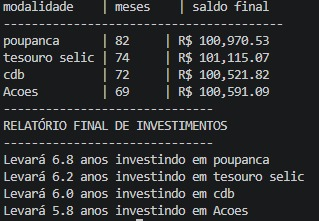

# Simulador de Investimentos Financeiros

Este projeto é uma ferramenta de simulação desenvolvida em **Python** para calcular o tempo e o saldo final de investimentos financeiros, baseando-se em aportes mensais fixos e juros compostos.

## Como funciona
O algoritmo percorre diferentes modalidades de investimento (Poupança, Tesouro Selic, CDB e Ações), aplicando a taxa de rentabilidade anual convertida para mensal. Ele utiliza estruturas de repetição (`for` e `while`) para encontrar o momento exato em que a meta financeira de R$ 100.000,00 é atingida.

## Exemplo de Saída
O programa gera um relatório consolidado com o tempo necessário para cada modalidade:

## Tecnologias Utilizadas
- Python 3.x
- Estruturas de dados (Dicionários e Listas)
- F-strings para formatação de dados

## Como rodar
1. Certifique-se de ter o Python instalado.
2. Clone este repositório ou baixe o arquivo `simulador.py`.
3. Execute o comando: `python simulador.py`
